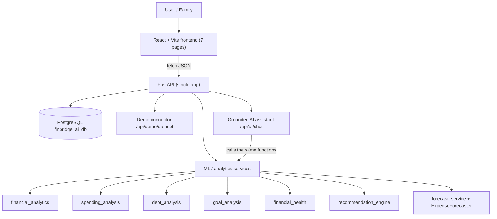
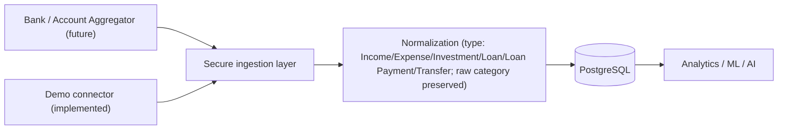

# FinBridge AI — Architecture

## Data flow (as implemented)
1. The frontend loads `/api/demo/dataset`. This is a **simulated** transaction feed standing in for a future bank connector.
2. It posts that data to `/api/m2/analysis`, `/api/forecast` and `/api/goals/analyze`.
3. The services compute the results. The frontend only renders them and hard-codes no numbers.
4. The AI chat sends the question and data to `/api/ai/chat`. The steps are: intent → analytics function → verified figures → answer.

## Ingestion design (target)

## Components
| Layer | Tech | Location |
|---|---|---|
| Frontend | React 18, React Router, Recharts, CSS variables for themes | `frontend/` |
| API | FastAPI, Pydantic v2 | `backend/app/` |
| DB | PostgreSQL + SQLAlchemy | `backend/app/database.py` |
| Analytics/ML | Python, scikit-learn, NumPy, DuckDB (large data) | `ml/` |
| AI | Rule-based intent router + grounded templates (LLM-ready) | `ml/services/ai_assistant.py` |

## Endpoints
`GET /` `/health` `/project` `/version` `/team` `/features` `/status` `/db-health` `/db-test/transactions` ·
`POST /api/m2/analysis` · `POST /api/forecast` · `POST /api/goals/analyze` · `GET /api/goals/demo` ·
`POST /api/ai/chat` · `GET /api/demo/dataset` · legacy `/expenses` CRUD (in-memory, Day-8 learning).
The interactive docs are at `/docs`.
